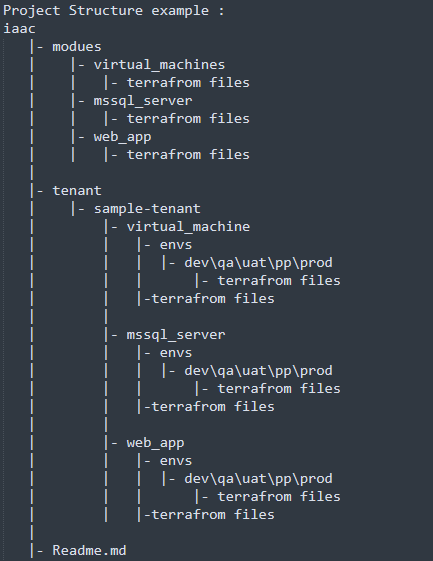
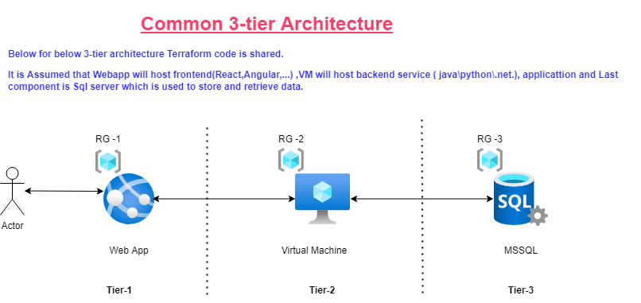

## Challenge #1 --> iaac
_____________

### Steps to execute Terrafrom code:

 1) traverse to resource DIR
 
cd iaac/tenant/sample-tenant/{resource}

 2)  Set ENV_DIR variable to one of following dev,qa,uat,preprod and prod.
 
ENV_DIR="dev"

PLAN_FILE="terraform-plan.tfplan"

 3) Terrafrom Initialization.
terraform init -backend-config="$ENV_DIR\backend.tfvars" -reconfigure

 4) Terrafrom plan.
 
terrafrom plan -var-file="$ENV_DIR\terrafrom.tfvars" -out="$PLAN_FILE"

 5) Terrafrom deploy resource from plan file.
 
Terrafrom apply -input=false -auto-approve "$PLAN_FILE"

  
  
  
___________________________________________________________________________________

   
   

### Refrences: Terrafrom Code:
https://www.codeproject.com/Articles/5260755/Create-an-Azure-Virtual-Machine-with-Terraform
https://registry.terraform.io/providers/hashicorp/azurerm/latest/docs/resources/mssql_database
https://registry.terraform.io/providers/hashicorp/azurerm/latest/docs/resources/linux_web_app

___________________________________________________________________________________

## Challenge #2  --> aws_instance_metadata
_____________

### Steps to execute python code:
-------------------------------

 0) Prerequisite:

Install  python and pip : https://docs.aws.amazon.com/elasticbeanstalk/latest/dg/eb-cli3-install-linux.html

Configure awscli : https://docs.aws.amazon.com/cli/latest/userguide/cli-configure-quickstart.html

 1) Install boto3 python module
 
pip install boto3

 2) Run the python script ,enter the key to search.
 
python aws_instance_metadata/get_aws_instance_metadata.py

### Refrences: 

https://boto3.amazonaws.com/v1/documentation/api/latest/reference/services/ec2.html#EC2.Client.describe_instances
___________________________________________________________________________________

## Challenge #3 --> getvaluefromobject
______________________________________

### Steps to execute python code:
-------------------------------

 1) Run the python script.

python getvaluefromobject/getValueFromObjectForKey_ifexist.py

### Refrences: 

https://stackoverflow.com/questions/39233973/get-all-keys-of-a-nested-dictionary
